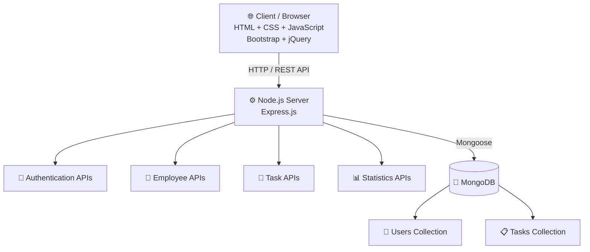
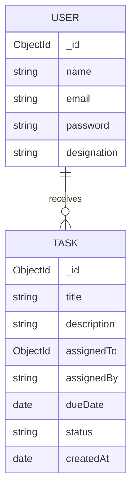
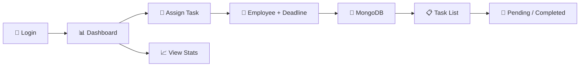

# 🗂️ Task Management System

> **Summer Internship Project** — a responsive full-stack task management system for assigning tasks, tracking progress, and viewing statistics.

<p align="center">


</p>

**[Features](#-features) • [Stack](#️-technology-stack) • [Setup](#-installation) • [API](#-api-documentation) • [Security](#-security-considerations)**

<details>
<summary>📚 Table of Contents</summary>

- [✨ Features](#-features)
- [🛠️ Technology Stack](#️-technology-stack)
- [🏗️ Architecture](#-architecture)
- [📁 Project Structure](#-project-structure)
- [🗄️ Database Design](#️-database-design)
- [🔌 API Documentation](#-api-documentation)
- [💻 Installation](#-installation)
- [🔄 Application Workflow](#-application-workflow)
- [🔐 Security Considerations](#-security-considerations)
- [🧪 Testing Checklist](#-testing-checklist)
- [🚀 Future Enhancements](#-future-enhancements)
- [👨‍💻 Author](#-author)

</details>

---

## 📌 Overview

A browser-based task management application where users can register/login, assign employee tasks, set deadlines, track status, and monitor dashboard statistics.

### ✨ Features

<details open>
<summary><strong>Core Features</strong></summary>

- 👤 User registration & login
- 📊 Dashboard with task statistics
- 📝 Task assignment with deadlines and descriptions
- 👥 Dynamic employee selection
- 🔄 Pending / Completed status tracking
- 📋 Search, pagination, sorting and exports
- 📱 Responsive Bootstrap UI
- 🖨️ CSV, Excel, PDF and Print support

</details>

### 🎯 Objectives

- Digitize task assignment and tracking.
- Persist users/tasks in MongoDB.
- Provide REST APIs for frontend-backend communication.
- Improve task visibility through dashboard statistics.
- Provide filtering, pagination and export capabilities.

---

## 🛠️ Technology Stack

### Frontend

| Technology | Purpose |
|---|---|
| HTML5 | Page structure |
| CSS3 | Custom styling and responsive layout |
| JavaScript ES6+ | Frontend logic and API communication |
| Bootstrap 5 | UI components and responsive design |
| jQuery | DOM manipulation and DataTables integration |
| Select2 | Enhanced employee dropdown |
| DataTables | Task table, pagination and exports |
| Bootstrap Icons | Interface icons |

### Backend

| Technology | Purpose |
|---|---|
| Node.js | JavaScript runtime |
| Express.js | Web server and REST APIs |
| Mongoose | MongoDB object modeling |
| dotenv | Environment variable management |
| Nodemon | Development auto-restart |

### Database

**MongoDB** stores:

- Users
- Tasks

---

---

## 🏗️ Architecture



### Architecture Flow

```text
Browser
   │
   │ HTTP / REST API
   ▼
Express.js
   │
   │ Mongoose
   ▼
MongoDB
```

---

---

## 📁 Project Structure

```text
Task management/
│
├── client/
│   ├── public/
│   │   ├── css/
│   │   │   └── style.css
│   │   ├── js/
│   │   │   ├── dashboard.js
│   │   │   ├── login.js
│   │   │   ├── register.js
│   │   │   └── task.js
│   │   └── uploads/
│   │       ├── image.png
│   │       ├── login.png
│   │       └── profile.jpg
│   │
│   └── views/
│       ├── dashboard.html
│       ├── login.html
│       ├── register.html
│       └── tasks.html
│
├── server/
│   ├── models/
│   │   ├── Task.js
│   │   └── User.js
│   ├── app.js
│   └── server.js
│
├── .env
├── package.json
└── package-lock.json
```

---

---

## 🗄️ Database Design

### 👤 User Model

**File:** `server/models/User.js`

| Field | Type | Required |
|---|---|---|
| `name` | String | Yes |
| `email` | String | Yes / Unique |
| `password` | String | Yes |
| `designation` | String | Yes |

### 📋 Task Model

**File:** `server/models/Task.js`

| Field | Type | Required | Description |
|---|---|---|---|
| `title` | String | Yes | Task name |
| `description` | String | No | Task details |
| `assignedTo` | ObjectId | Yes | Reference to User |
| `assignedBy` | String | Yes | Creator's designation |
| `dueDate` | Date | Yes | Task deadline |
| `status` | String | No | Pending / Completed |
| `createdAt` | Date | No | Creation timestamp |

### Relationship



---

---

## 🔌 API Documentation

### Authentication

#### Register User

```http
POST /api/register
Content-Type: application/json
```

```json
{
  "name": "Test",
  "email": "test@example.com",
  "password": "test123",
  "designation": "Software Engineer"
}
```

#### Login User

```http
POST /api/login
Content-Type: application/json
```

```json
{
  "email": "test@example.com",
  "password": "test"
}
```

---

### Employee API

#### Get Employees

```http
GET /api/employees
```

Example response:

```json
{
  "status": "success",
  "data": [
    {
      "_id": "USER_ID",
      "name": "test",
      "designation": "Software Engineer",
      "email": "test@example.com"
    }
  ]
}
```

---

### Task APIs

#### Create Task

```http
POST /api/tasks
Content-Type: application/json
```

```json
{
  "title": "Prepare project report",
  "description": "Prepare and submit the project report.",
  "assignedTo": "USER_ID",
  "assignedBy": "Project Manager",
  "dueDate": "2026-09-30"
}
```

#### Get All Tasks

```http
GET /api/tasks
```

Tasks are returned newest first and `assignedTo` is populated with employee information.

#### Update Task Status

```http
PATCH /api/tasks/:id/status
Content-Type: application/json
```

```json
{
  "status": "Completed"
}
```

Supported values:

```text
Pending
Completed
```

#### Get Task Statistics

```http
GET /api/tasks/stats
```

Example:

```json
{
  "status": "success",
  "data": {
    "totalThisMonth": 12,
    "completed": 7,
    "pending": 5
  }
}
```

---

---

## ⚙️ Environment Configuration

Create `.env` in the project root:

```env
MONGODB_URI=mongodb://127.0.0.1:27017/task_management
PORT=3000
```

For MongoDB Atlas:

```env
MONGODB_URI=mongodb+srv://<username>:<password>@<cluster>/<database>
PORT=3000
```

> 🔒 **Never commit real MongoDB credentials or secrets to GitHub.** Add `.env` to `.gitignore`.

---

---

## 💻 Installation

### Prerequisites

- Node.js 16+
- npm
- MongoDB Community Server **or** MongoDB Atlas
- Git (optional)
- VS Code (recommended)

Check versions:

```bash
node --version
npm --version
```

### 1. Clone the repository

```bash
git clone https://github.com/Piyushh-07/<Task-mangement>.git
cd "Task management"
```

### 2. Install dependencies

```bash
npm install
```

Main dependencies include:

```text
express
mongoose
dotenv
bcryptjs
jsonwebtoken
cookie-parser
nodemon
```

### 3. Configure MongoDB

For local MongoDB:

```env
MONGODB_URI=mongodb://127.0.0.1:27017/task_management
```

For Atlas:

```env
MONGODB_URI=your_mongodb_connection_string
```

### 4. Start the development server

```bash
npm run dev
```

Expected output:

```text
Connected to MongoDB successfully.
Default employees seeded successfully.
Server is running on port 8080
```

### 5. Open the application

Visit:

```text
http://localhost:8080
```

### Production-style start

```bash
npm start
```

---

---

## 🔄 Application Workflow



---

## 🔐 Security Considerations

> This is an internship/demo implementation. Review these items before production deployment.

### Current implementation

- Authentication state is stored in browser `localStorage`.
- JWT and bcrypt packages are present but the current authentication code does not use them.
- API endpoints do not currently implement server-side authorization middleware.
- Sample credentials are included in seed logic.


---

---

## 🧪 Testing Checklist

### Registration

- [✅] Register with valid information.
- [✅] Register with missing fields.
- [✅] Register using an existing email.
- [✅] Verify successful registration redirects to dashboard.

### Login

- [✅] Login with valid credentials.
- [✅] Login with an incorrect password.
- [✅] Login with an unregistered email.
- [✅] Verify unauthenticated users are redirected to login.

### Task Assignment

- [✅] Open dashboard.
- [✅] Verify employee list loads.
- [✅] Enter task title.
- [✅] Select employee.
- [✅] Select deadline.
- [✅] Enter description.
- [✅] Submit task.
- [✅] Verify task appears in recent tasks.

### Task Management

- [✅] Open Tasks page.
- [✅] Verify tasks are displayed.
- [✅] Change task status.
- [✅] Refresh the page.
- [✅] Verify status persists in MongoDB.
- [✅] Test pagination.
- [✅] Test CSV export.
- [✅] Test Excel export.
- [✅] Test PDF export.
- [✅] Test Print.

### Dashboard Statistics

- [✅] Verify monthly task count.
- [✅] Verify completed count.
- [✅] Verify pending count.
- [✅] Create a task and confirm statistics update.

---

---

## 🚀 Future Enhancements

<details>
<summary><strong>🔐 Authentication & Authorization</strong></summary>

- Secure password hashing
- JWT authentication
- Role-based access control
- Admin / Manager / Employee roles
- Permission-based APIs
- Password reset
- Email verification

</details>

<details>
<summary><strong>📝 Advanced Task Management</strong></summary>

- Edit tasks
- Delete tasks
- Task priorities
- Task categories
- Task attachments
- Task comments
- Subtasks
- Task activity history
- Recurring tasks

</details>

<details>
<summary><strong>🔔 Notifications</strong></summary>

- Email notifications
- Deadline reminders
- In-app notifications
- Overdue task alerts

</details>

<details>
<summary><strong>📊 Advanced Dashboard</strong></summary>

- Charts and graphs
- Employee performance analytics
- Monthly/weekly task trends
- Overdue task statistics
- Department-wise reports

</details>

<details>
<summary><strong>👥 User Management</strong></summary>

- Profile management
- Profile photo upload
- Employee search
- Department management
- Designation management

</details>

### Deployment Direction

```text
Frontend  → Vercel / Netlify
Backend   → Render / Railway / AWS
Database  → MongoDB Atlas
```

---

---

## 🐛 Known Limitations

The current version is primarily intended for internship/demo purposes.

- No complete server-side authentication middleware.
- Passwords are not hashed in the current implementation.
- No role-based access control.
- No task deletion/editing API.
- `assignedBy` is stored as a designation string rather than a User reference.
- Frontend relies on `localStorage` for login state.
- Forgot Password and Google Login UI elements are placeholders.
- Settings navigation is currently a placeholder.
- Some dependencies are included for future/security-related improvements but are not currently used.
- Error handling can be expanded with more user-friendly messages and centralized middleware.

---

---

## 📝 Internship Project Outcome

During development, the project provided practical experience with:

- Designing a full-stack web application.
- Creating a responsive frontend.
- Developing REST APIs using Express.js.
- Connecting Node.js with MongoDB using Mongoose.
- Designing MongoDB schemas.
- Implementing registration and login workflows.
- Building task assignment and tracking functionality.
- Connecting frontend forms with backend APIs.
- Dynamically rendering database records.
- Implementing task status updates.
- Creating dashboard statistics.
- Working with third-party frontend libraries.
- Debugging client-server integration issues.
- Structuring a real-world application into frontend, backend, and database layers.

---

---

## 📌 Project Information

| Property | Value |
|---|---|
| **Project** | Task Management System |
| **Type** | Summer Internship Project |
| **Category** | Full-Stack Web Application |
| **Architecture** | Client–Server |
| **Frontend** | HTML5, CSS3, JavaScript, Bootstrap, jQuery |
| **Backend** | Node.js, Express.js |
| **Database** | MongoDB |
| **ODM** | Mongoose |

---

---

## 👨‍💻 Author

### **Piyush Yadav**

**B.Tech — Computer Science & Engineering**

- 🐙 GitHub: [Piyushh-07](https://github.com/Piyushh-07)
- 💼 LinkedIn: [Piyush Yadav](https://www.linkedin.com/in/piyush-yadav-a59a722a9/)
- 🧩 LeetCode: [Piyushh_77](https://leetcode.com/u/Piyushh_78/)

---

---

## 📄 License

Developed as a summer internship project for educational, demonstration and portfolio purposes.

<p align="center"><strong>⭐ If you found this project useful, consider starring the repository!</strong></p>
